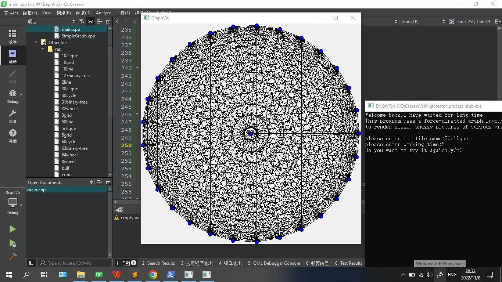
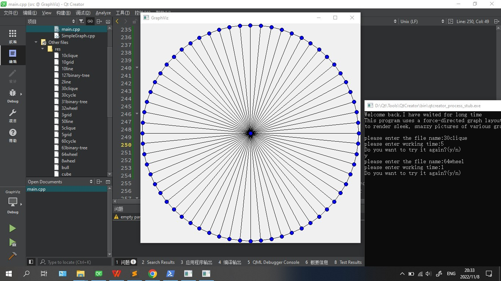

# 大作业内容

给一个图的点数和边连接情况，要求控制点之间的距离和边的角度，得到各个点尽量分散开的图

2023.5.13补充README，把当时用word写的一些信息转换成md格式内容

## 分析

以下应该是开始项目前的需求分析的内容，主要是从要求的pdf里面摘取了一些内容

~~~
1:Position connected nodes near one another
2:Maximize the distance between unconnected nodes.
start off with a random guess
then continuously refine
each node repel each other node with some force
each edge between nodes attract its endpoints

  Details:
1:initialize the positions of the nodes however we choose
2:decide when to stop based on multiple criteria
3:use almost any function to determine the strengths of the attractive and repulsive forces between 

  nodes
(highly encourage you to try out your own variations; I've suggested several ideas at the end of this handout)
one particular version:
1:evenly spaced apart on the unit circle
2:asking the user to control how long the algorithm runs
3:Fruchterman-Reingold algorithm
computed the magnitude of the repulsive force
force splits up

  The Assignment
1:name
2:number of seconds,which should be positive.
3:Place each node into its initial configuration.
4:While the specified number of seconds has not elapsed
1. Compute the net forces on each node.
2. Move each node by the specified amount.
3. Display the current state of the graph using the provided library

  file
first line contains the number of nodes
each remaining line defines an edge
if you wanted to make this program more resilient you may want to add some code to check that this is the case.

  Task Breakdown
(it may actually require more code to prompt the user for a valid filename than to actual read in the graph.)
initially we suggest just putting the iteration in a while (true) loop and just letting the algorithm run forever
Advice, Tips and Tricks

  Extensions
1. Change the relative strength of the attractive and repulsive forces.
2. Add random pertubations.giving each node a slight“push” in a random direction
3. Add node velocities.track the Δx and Δy of each object from one iteration to the next, rather than resetting it to zero each time
4. Add penalties for crossing edges(*)
(1)	detect these crossings
(2)	adjust the layout accordingly
One common approach:pretend that there is an invisible node at the center of each edge that exerts a repulsive force against the center of each other edge
5. Add penalties for low resolution(*)
(1)	add a repulsive force between the endpoints of arcs that have a small angle between them
6. Generalize the definition of an attractive force(*).have each node exert an attractive force on each other node proportional to how “close” they are to one another in the initial graph.

~~~

## 完成

**1：关于xcopy问题**

感谢助教帮忙。现在只要每次删去配置文件即可编译运行

**2：关于特性：**

1.输入时检验运行时间（文件名没做好

2.输入边的时候排序，方便检测两条边形成夹角，并预处理了夹角

3.特判了是不是有一个点和其他所有点相连，如果是，那么把这个点放中间（但是用处很大）

4.采用速度和摩擦力

5.采用夹角惩罚，惩罚形式为：如果夹角小于60°则给两条边施加斥力，如果夹角大于120°，则两条边施加引力

6.加入随机push（会鬼畜）

7.自己写了个extinsion：如果一条边的长度小于平均值的五分之一就施加一个推力

8.extionsion被注释了

**3.关于常数**

感觉效果还可以，如果更改并不会更好很多

**4.关于进一步优化**

希望加入边交叉惩罚

日期：2022.11.6

---

update to github

**文件说明**

图形化库采用QT-6

两张图片为效果演示

src/SimpleGraph.* 为作业提供的utility，非个人所写

res中为测试数据

.pro&.user文件忘记是什么了
